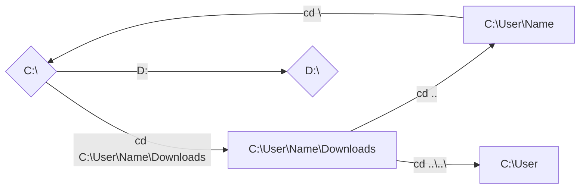

<div  align="center">
<a  href="https://www.microsoft.com/en-us/">

</a>
<a  href="https://github.com">

</a>
<a  href="https://git-scm.com">

</a>
</div>
<h3  align="center">CMD CheatSheet for Windows and Github/Git</h3>


This document contains a short compilation of commands to use on **CMD**(Command Prompts) for both **Windows** and **Github**.

<hr>

<h3 align="center" >INDEX</h3>

- [Notes](#notes)
- [Parameters](#parameters)
- [Windows](#windows)
- [Github/Git](#github/git)
- [Bibliography](#bibliography)

<hr>

<a id="notes"></a>
<h3  align="center" >NOTES</h3>

>This is not a extensive list of all commands for both **Windows** and **Github/Git**.

>All **Windows** commands work as intended on **Windows 11** althought I can't confirm if works on older versions.

<hr>

<a id="parameters"></a>
<h3  align="center" >PARAMETERS</h3>

Parameters(also called switches,flags or options) are prefixes that change the behavior of a command. In order to use a parameter you must write them always after the command itself and with a **/** before a letter.

```md
dir /w
```

 >You can use as many parameters as you want, just put a space between every one .

<hr>

<a id="windows"></a>
<div align="center">
<a href="https://www.microsoft.com/en-us/">

</a>
</div>

# Path Location
```md
cd [folder path]
```
- Moves directly to the given path

-> Example:
```md
cd C:\User\Name\Downloads
```
<hr>

```md
cd ..
```
- Go up one level in the folder hierarchy

-> Example:
```md
cd C:\User\Name\Downloads
cd ..
```
- You're now in **C:\User\Name** 

<hr>

```md
cd ..\..\
```
 - Go up as many levels in the folder hierarchy as many **..\\** you have

-> Example:
```md
cd C:\User\Name\Downloads
cd ..\..\
```
- You're now in **C:\User** 
<hr>

```md
cd \
```
- Go directly to the root of your drive

-> Example:
```md
cd C:\User\Name\Downloads
cd \
```
- You're now in **C:\\**
<hr>

```md
cd
```
- Displays the full path of the current directory

-> Example:
```md
cd C:\User\Name\Downloads
cd
```
- Will display **C:\User\Name\Downloads**
<hr>

```md
[drive letter]:
```
- Moves to the drive with the respective letter

-> Example:
```md
D:
```
- You're now at the **D** drive if you have
<hr>


<hr>

# Files and Folders Management
```md
dir
```
- List all files and folders inside of the current directory

-> Example:
```md
cd C:\
dir
```
- With the dir command will show every file and folder inside of the **C:\\** drive

 Some useful [parameters](#parameters) for the dir command:
 - /w -> Formats the list in a wide way and shows only the files and folders names
 - /p -> Pauses after each section of information
 -  /s -> Lists all files in the directory and all his subdirectories

<hr>

```md
mkdir [folder name]
```
- Creates a new folder

-> Example:
```md
mkdir Pictures
```
- It will create a folder called **Pictures**

<hr>

<a id="github/git"></a>
<div  align="center">
<a  href="https://github.com">

</a>
<a  href="https://git-scm.com">

</a>
</div>

<a id="bibliography"></a>
# Biliography

-  <a  href="https://training.github.com">Oficial Github/Git CheatSheet</a>
-  <a  href="https://skillicons.dev">Icons</a>
-  <a  href="https://stackedit.io">Markdown Editor</a>
- Multiple Sources used for **Windows CMD** commands

<!-- 

|Single backticks|`'Isn't this fun?'` |'Isn't this fun?' |

|Quotes |`"Isn't this fun?"` |"Isn't this fun?" |

|Dashes |`-- is en-dash, --- is em-dash`|-- is en-dash, --- is em-dash|


-->